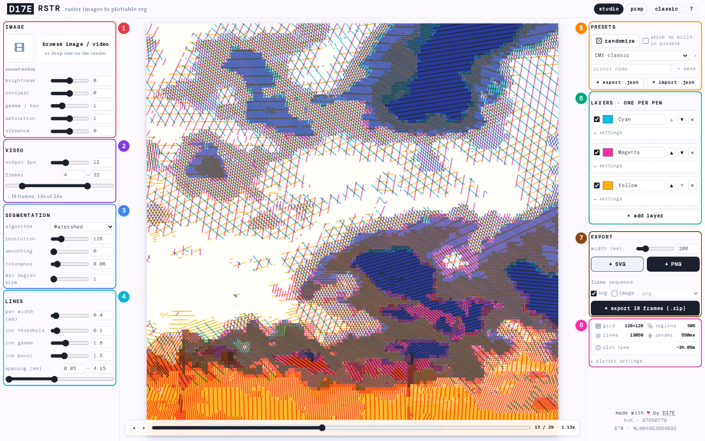

# RSTR

**Turn any image or video into plottable, multi-pen hatched line art — entirely in your browser.**

RSTR splits a picture into regions of similar tone and refills each one with parallel pen strokes: dense where the image is dark, sparse where it's light. The result is a layered SVG a [pen plotter](https://d17e.dev/projects/plotter-art/) can draw with real ink on real paper — or a PNG to share and print. Everything runs in your browser and your image never leaves your device. The one exception is deliberate: when you order a physical plot, the finished plot file (the drawn lines as SVG — never your photo) is uploaded into the plot queue.

🎨 **Live app:** [rstr.d17e.dev](https://rstr.d17e.dev) · 📖 **How to use it:** the in-app [help page](https://rstr.d17e.dev/help) documents every control · 🖋️ **The art:** [#madewithrstr](https://d17e.dev/projects/rstr/)

[](license.txt)

---

## The studio at a glance



| #   | Section          | What it does                                                                                            |
| --- | ---------------- | ------------------------------------------------------------------------------------------------------- |
| 1   | **image**        | Load a picture or video and tune it (brightness, contrast, gamma, saturation, vibrance) before tracing. |
| 2   | **video**        | Frame rate and export window — shown while a video is loaded.                                           |
| 3   | **segmentation** | How the image is carved into tonal regions (watershed, posterize, k-means, SLIC).                       |
| 4   | **lines**        | Pen width and how ink intensity turns into line spacing.                                                |
| 5   | **presets**      | Randomize everything, or save and share complete looks as JSON.                                         |
| 6   | **layers**       | One pen per layer: color, image channel, hatch angles, per-layer overrides.                             |
| 7   | **export**       | Output width (or fit-to-page A6–A3 with a margin) and the SVG / PNG / frame-sequence downloads.         |
| 8   | **stats**        | Render numbers and the estimated plot time.                                                             |

> This README covers **how RSTR is built**. For what each setting _does_, see the [help page](https://rstr.d17e.dev/help) (`src/routes/(site)/help/+page.svelte`) — it mirrors the in-app tooltips.

---

## How it works

RSTR is a fully client-side image pipeline. An image (or a single video frame) flows through a chain of stages, each one a self-contained function over flat typed arrays:

```
image → pixels → cell grid → color adjust → per-layer channel extract
      → segmentation (watershed | posterize | k-means | SLIC)
      → region geometry (contour tracing, holes included)
      → hatching (ink-driven line spacing per region)
      → preview (canvas) + export (SVG per pen / PNG / frame-sequence zip)
```

Each stage is wired to Svelte 5 runes as an independent `$effect` with its own dependency set, so a slider only recomputes its own stage and everything downstream — dragging a pen-width slider never re-runs the watershed. Long stages yield to the frame loop and abandon stale generations, which keeps the sliders responsive on large grids.

**Segmentation** is where the character comes from. All four algorithms work on the same cell grid and share the same post-processing (tolerance-based region merging, small-region absorption, compact relabeling), so they're interchangeable:

- **Watershed** — a Meyer-style priority flood from gradient minima, then tolerance merging on the region adjacency graph. Follows tonal basins.
- **Posterize** — quantizes intensity into levels, then connected-component labeling. Blocky and banded.
- **K-means** — 1-D k-means clustering on intensity. An adaptive posterize.
- **SLIC** — localized k-means over `(x, y, intensity)` that carves the grid into compact, roughly cell-sized superpixels, then merges similar neighbours. Mosaic-like.

**Layers** are the pen model. A layer is just data: an image channel (cyan / magenta / yellow / key / R / G / B / luminance) that drives its ink amount, plus a color, a hatch-angle range, and optional per-layer overrides of the global line settings. Each layer maps to one physical pen and becomes one `<g>` in the exported SVG. CMY is only the default stack.

**Hatching** fills each region's contours (holes included) with parallel lines whose spacing is driven by the region's mean ink, through a configurable gamma/boost curve. Each region picks its own angle within the layer's range based on its shape, so a single pen never looks mechanical.

**Plot-time estimation** is a duration-only port of [saxi](https://github.com/nornagon/saxi)'s constant-acceleration motion planner (which itself derives from [fogleman/axi](https://github.com/fogleman/axi)): per-segment cornering velocities, trapezoidal velocity profiles, pen lift/drop pauses and pen-up travel. Match the plotter profile to saxi's options and the estimate lines up with what saxi reports for the exported file.

---

## Code layout

The engine (`src/lib/rstr2/`) is pure TypeScript with no framework imports, so it's fully unit-testable in isolation:

| File                                                                              | Responsibility                                                                                                                                                                                                                       |
| --------------------------------------------------------------------------------- | ------------------------------------------------------------------------------------------------------------------------------------------------------------------------------------------------------------------------------------ |
| `grid.ts`                                                                         | Downsample the source image to the working cell grid.                                                                                                                                                                                |
| `imageAdjust.ts`                                                                  | Brightness / contrast / gamma / saturation / vibrance.                                                                                                                                                                               |
| `segmentation.ts`                                                                 | Watershed / posterize / k-means / SLIC + shared post-processing.                                                                                                                                                                     |
| `regionTools.ts`                                                                  | Region contour tracing (with holes).                                                                                                                                                                                                 |
| `hatchTools.ts`                                                                   | Hatch-line generation and the ink→spacing curves.                                                                                                                                                                                    |
| `layers.ts`                                                                       | Layer model (channel + pen mapping), defaults, persistence.                                                                                                                                                                          |
| `params.ts`                                                                       | Global parameter defaults and localStorage persistence.                                                                                                                                                                              |
| `inkColors.ts`                                                                    | Curated real-ink palette and color harmonies for the dice.                                                                                                                                                                           |
| `randomize.ts`                                                                    | The one-click randomize roll and the `RngProfile` model behind it.                                                                                                                                                                   |
| `distributions.ts` · `rngSources.ts` · `rngProfiles.ts` · `rngBuiltinProfiles.ts` | The tunable randomness stack — sampling strategies, seeded rng streams, profile storage and the shipped-profile registry. Tuned visually in the studio's dev-only rng debug panel; see [docs/rng-profiles.md](docs/rng-profiles.md). |
| `presets.ts`                                                                      | Built-in and user presets, JSON import/export.                                                                                                                                                                                       |
| `plotTime.ts`                                                                     | saxi-compatible plot-time estimation.                                                                                                                                                                                                |
| `svgExport.ts`                                                                    | Standalone SVG document assembly (one group per pen).                                                                                                                                                                                |
| `video.ts` · `zip.ts`                                                             | Video-frame sampling math and a dependency-free stored-ZIP writer for frame-sequence export.                                                                                                                                         |

Most of these are backed by `*.test.ts` unit tests in the same folder.

Other notable areas:

- `src/lib/prep/` — the **plot prep** tool: takes an exported SVG and dresses it for the machine (output page, paper outline, calibration markers, reversed-layer doubling). `reverse.ts` reverses SVG path direction so a layer can be plotted twice for denser ink.
- `src/lib/rstr/` + `src/lib/ccp/` — the **classic** engine, the original Paper.js-based RSTR, kept intact for nostalgia. Marked `@ts-nocheck` and intentionally left as-is.
- `src/lib/fsm.svelte.ts` — a small state machine for the render lifecycle (`config → render → done / error / exporting`).
- `src/service-worker.ts` — precaches the app shell so it works offline; RSTR is an installable PWA.
- `workers/order-upload/` — the Cloudflare Worker behind **⚡ order this plot**: takes the exported plot SVG (only the drawn lines — never the source image), verifies it against its design fingerprint and stores it, rate-limited, in a private R2 bucket. Deploy and retention notes live in `workers/order-upload/README.md`.

### Routes

| Route                       | Purpose                                                                                   |
| --------------------------- | ----------------------------------------------------------------------------------------- |
| `/`                         | Landing page.                                                                             |
| `/studio`                   | The main studio — the `rstr2` engine (client-rendered only; state lives in localStorage). |
| `/prep`                     | Plot prep tool.                                                                           |
| `/classic`                  | The original Paper.js RSTR.                                                               |
| `/help`                     | Full settings & feature reference.                                                        |
| `/about`, `/landing`, `/v2` | Redirects (`/about`→`/help`, `/landing`→`/`, `/v2`→`/studio`) so old links keep working.  |

---

## Tech stack

- **[Svelte 5](https://svelte.dev) + [SvelteKit 2](https://kit.svelte.dev)** — UI and routing, using runes (`$state` / `$derived` / `$effect`) for the reactive pipeline.
- **[Vite 8](https://vite.dev)** — dev server and build.
- **[TypeScript](https://www.typescriptlang.org)** — the engine and app code.
- **[Tailwind CSS 4](https://tailwindcss.com)** (via `@tailwindcss/vite`) with **[shadcn-svelte](https://shadcn-svelte.com)**, **[clsx](https://github.com/lukeed/clsx)**, **[tailwind-merge](https://github.com/dcastil/tailwind-merge)** and **[tailwind-variants](https://www.tailwind-variants.org)** for styling.
- **[Paper.js](http://paperjs.org)** — geometry engine behind the classic app.
- **[Tweakpane](https://tweakpane.github.io/docs/)** — the classic app's control panel.
- **[@stanko/dual-range-input](https://github.com/stanko-arbutina/dual-range-input)** by [Stanko Tadić (muffinman)](https://muffinman.io) — the min/max spacing sliders in the studio, built on his [native dual range input technique](https://muffinman.io/blog/native-dual-range-input/).
- **[Vitest](https://vitest.dev)** — unit tests · **[ESLint](https://eslint.org)** + **[Prettier](https://prettier.io)** — linting and formatting.

---

## Getting started

Requires **Node ≥ 20.19** (or ≥ 22.12) — `engine-strict` is on. Any of npm / pnpm / bun works; both a `bun.lock` and a `package-lock.json` are committed.

```bash
# install
npm install

# dev server (add -- --open to open a browser, or npm run dev-host for LAN access)
npm run dev

# production build + local preview
npm run build
npm run preview
```

### Scripts

| Command             | Does                                  |
| ------------------- | ------------------------------------- |
| `npm run dev`       | Start the Vite dev server.            |
| `npm run build`     | Production build.                     |
| `npm run preview`   | Preview the production build locally. |
| `npm test`          | Run the unit tests once (Vitest).     |
| `npm run test:unit` | Run Vitest in watch mode.             |
| `npm run check`     | Type-check with `svelte-check`.       |
| `npm run lint`      | Prettier check + ESLint.              |
| `npm run format`    | Format with Prettier.                 |

---

## Credits & acknowledgements

RSTR stands on a lot of other people's work:

- **[saxi](https://github.com/alexrudd2/saxi)** (alexrudd2's fork) and **[fogleman/axi](https://github.com/fogleman/axi)** — the motion model behind the plot-time estimate.
- **SLIC superpixels** (Achanta et al.) and **Meyer's watershed flooding** — the segmentation algorithms.
- The **[AxiDraw](https://shop.evilmadscientist.com/908)** by Evil Mad Scientist / Bantam Tools — the pen plotter RSTR targets.
- **Fountain- and drawing-ink makers** whose real colors seed the randomizer's palette: [De Atramentis](https://www.de-atramentis.com/en/Artist-ink-/), [Octopus Fluids](https://www.octopus-fluids.de/en/write-draw-inks), [Rohrer & Klingner](https://www.rohrer-klingner.de/en/en_home/) and [Diamine](https://www.diamineinks.co.uk/collections/diamine-50ml-forever-ink).
- **[IBM Plex Mono](https://www.ibm.com/plex/) and IBM Plex Serif** ([SIL Open Font License 1.1](https://openfontlicense.org)) — the interface typefaces.
- Reference reading that informed the approach: Kang et al.'s _Coherent Line Drawing_ (NPAR '07) and painterly-rendering / weighted-stippling work.

RSTR began as a sketch for the [Genuary '24](https://genuary24.d17e.dev/?prompt=5) prompt _"In the style of Vera Molnár"_ and grew from there. Made by **David Vandenbogaerde** ([d17e.dev](https://www.d17e.dev)), a software engineer and artist in Amsterdam.

---

## License

RSTR is released under the **[GNU General Public License v3.0](license.txt)**. You're free to use, study, share and modify it; derivative works must stay under the GPL. Anything you _create_ with RSTR is entirely yours — including commercial use.
